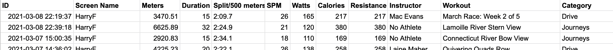
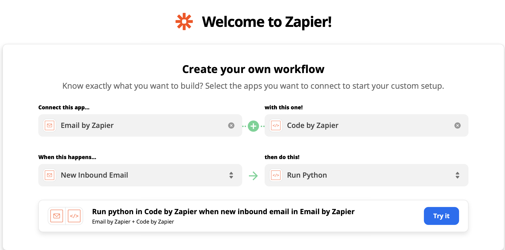
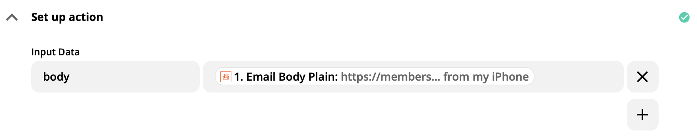
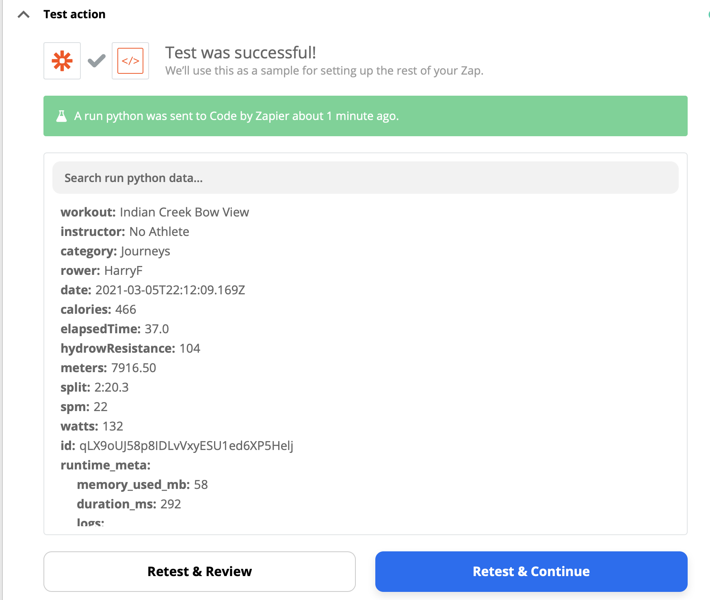
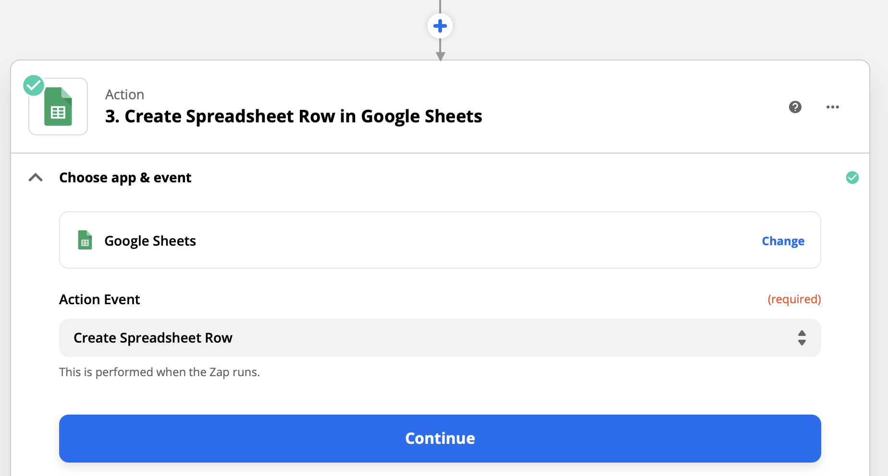
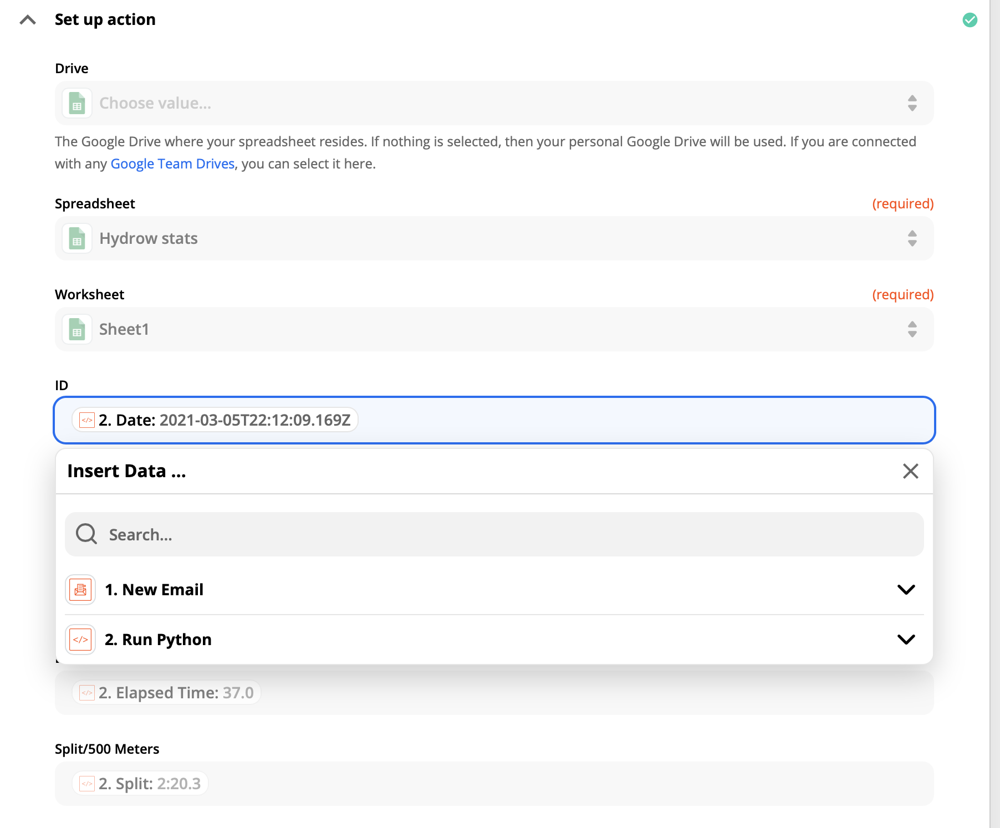

Sending Hydrow stats to Google Sheets via Zapier
================================================

One of the options for sharing a workout on the hydrow app is to email it someone. These
instructions describe how to automatically import those results into `Google Sheets`_, using Zapier_.
It is straightforward to use these instructions to 
send to other spreadsheet apps like Airtable_, which is also supported by Zapier_.

.. _Airtable: http://airtable.com
.. _Zapier: http://zapier.com
.. _Google sheets: http://google.com/sheets

Create accounts
---------------
You will need to create accounts on both platforms if you aren't already registered. 
Both have generous free tiers. 

Create a table to receive the data on Google Sheets
---------------------------------------------------
Create a table on Google Sheets to receive the data. 

An example is shown below. Yours will start out empty. 
Name the columns something sensible like what is shown here.

Set up an a mailbox with Zapier
-------------------------------

Zapier_ provides a service called Parser_ that will give you an email address. 
Go to parser.zapier.com and log in with your Zapier account. Create a Mailbox. 

.. _Parser: http://parser.zapier.com.

Create a Zap
------------

Now log in to zapier.com. Under ``Create your own workflow``, and fill it out as shown
below, connecting the email parser to python code. Then select ``Try it`` to get to
the rest of the configuration steps.

On the next step, you will have to point Zapier to your Parser_ account, and then under 
``set up trigger`` select the appropriate mailbox from your account.

Share a hydrow workout to your zapier email account. When you test this trigger, you should
see an indication that it got the email. That email contains the url of the workout, which is
what is going to be used for retrieving the data in the next step.

Your first ``Action`` step is ``Run Python``. 
Under ``Set up action`` set your input data to ``body`` and ``Email Body Plain``, 
as shown below.

Then paste the following code into the Code box.

.. code-block:: python

    # Cut and paste this into the "Run Python" Code section.
    # Set "Input Data" to "body"
    # Set the source of the input data to "Email Body Plain"
    import requests
    import re
    import json

    output = {}
    url = input_data['body'].split()[0]
    response = requests.get(url)
    pattern = re.compile('{"dataManager":.*}}}')
    result = pattern.findall(response.text)
    data = json.loads(result[0])
    output['workout'] = data['props']['pageProps']['workout']['workoutVideo']['name']
    output['instructor'] = data['props']['pageProps']['workout']['workoutVideo']['instructorName']
    output['category'] = data['props']['pageProps']['workout']['workoutVideo']['categoryName']
    output['rower'] = data['props']['pageProps']['workout']['rower']['screenName']
    output['date'] = data['props']['pageProps']['workout']['startTime']
    stats = data['props']['pageProps']['workout']['workoutStats']
    output['calories'] = stats['calories']
    output['hydrowResistance'] = stats['hydrowResistance']
    output['meters'] = stats['meters']
    output['spm'] = stats['strokesPerMinute']
    output['watts'] = stats['watts']
    # Convert elapsed time to minutes
    output['elapsedTime'] = f"{float(stats['elapsedTime'])/60.}"
    # Convert the split to minutes:seconds (a string)
    split = float(stats['splitTime'])/60.
    split_minutes = int(split)
    split_seconds = 60.*(split-split_minutes)
    output['split'] = f"{split_minutes}:{split_seconds:04.1f}"

    return output

Go ahead and test your action. You should should see something like the following,
which shows that it has fetched the data from the URL and put it into fields that
will be used in the next step to populate the Google sheet. 

Now add another action. Select ``Google sheets`` as the app and ``Create Spreadsheet Row in Google Sheets`` 
as the action.

Point Zapier to your google account and select the spreadsheet that you created there.
Now under ``Set up action`` you are going to link the spreadsheet columns to the output
of the python code (the ``Run Python`` step). You will have to do this field by field through the dropdown menus.
An example is shown below.

Now if you test the action, it should add a row to the google sheet. If that works you
can just turn on your zap and it will add a row any time you send an email to your 
Zapier Parser_ account. It will generally appear within seconds, but could take a few
minutes in principle. 
